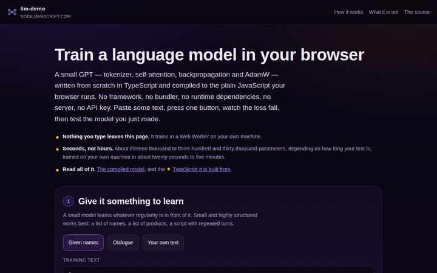
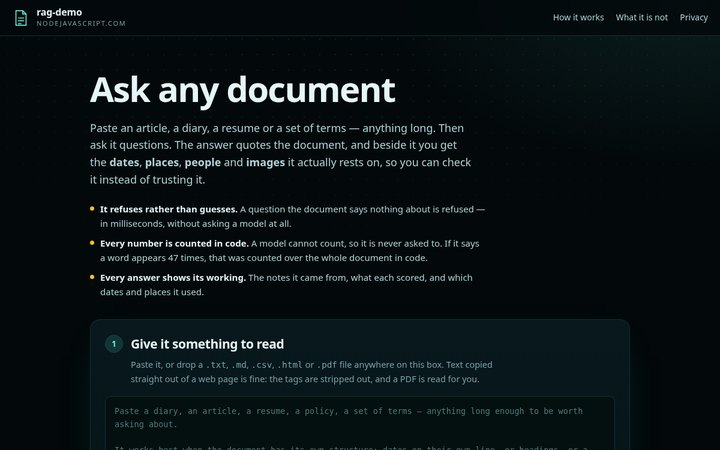
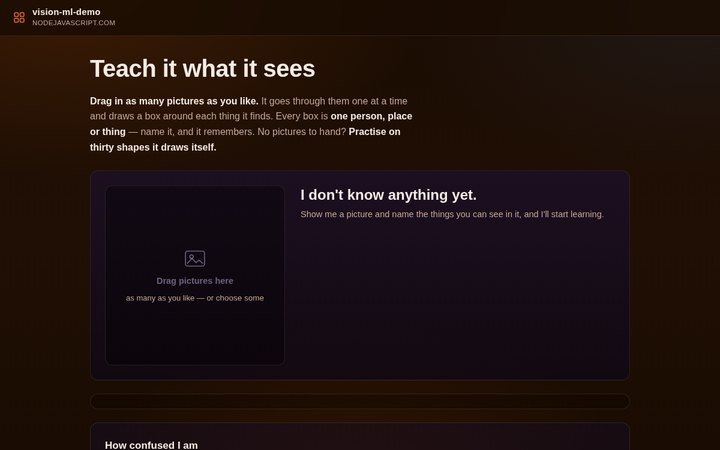
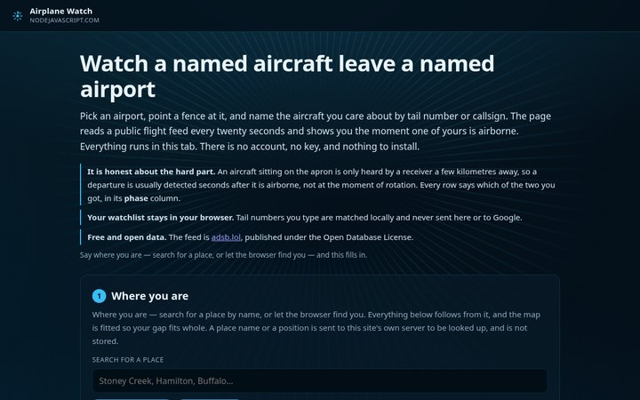
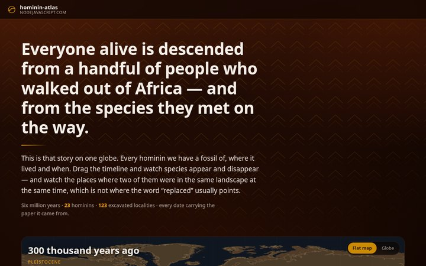
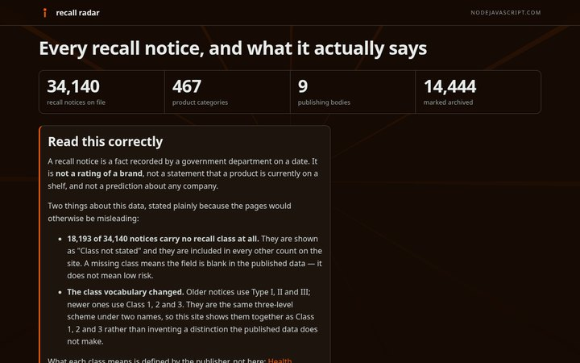
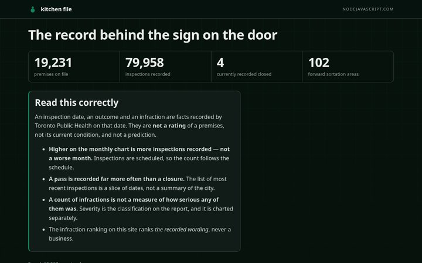
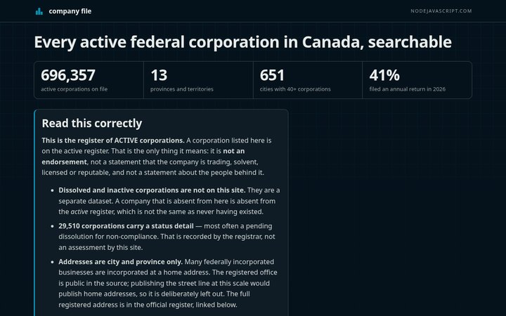
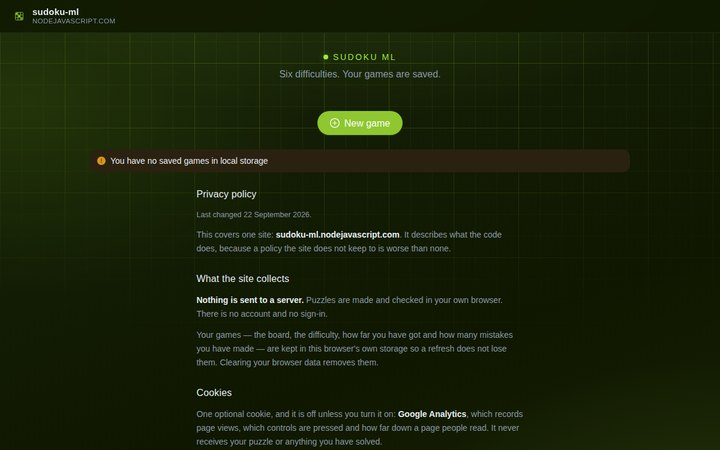
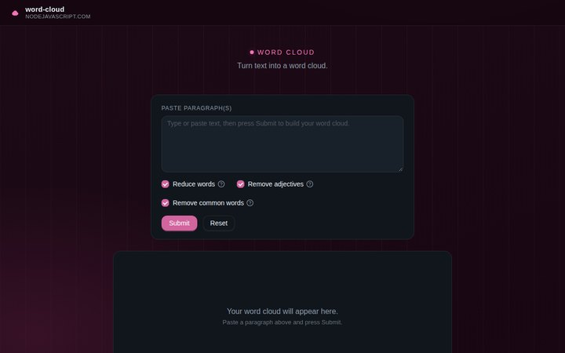

# George Fielder

**Senior Full-Stack & AI Engineer** — 25 years building web and database systems, the last decade in TypeScript, Node.js, React, Next.js and AI
Hamilton, Ontario, Canada

[georgefielder@gmail.com](mailto:georgefielder@gmail.com) · [LinkedIn](https://linkedin.com/in/georgefielder) · [datavisionstudios.com](https://datavisionstudios.com) · [nodejavascript.com](https://nodejavascript.com)

**Available now** — remote from Ontario, Canada (Eastern time), or hybrid within about an hour of Hamilton.

---

**I build AI systems that run on the machine in front of you, not on somebody else's server — and I ship them in public, where you can click them right now.**

You should not have to take a résumé's word for anything. Everything below is live, free, and about thirty seconds from being understood. The screenshots are the pages themselves — click one and you are there. The sections are the same ones my index uses, and [nodejavascript.com](https://nodejavascript.com/) lists all of it.

## Artificial intelligence & machine learning

| | |
|---|---|
|  | **[llm-demo.nodejavascript.com](https://llm-demo.nodejavascript.com/)** A small GPT written from scratch in TypeScript and trained in your own browser — tokenizer, self-attention, hand-derived backpropagation, AdamW. Nothing you type leaves the page. |
|  | **[rag-demo.nodejavascript.com](https://rag-demo.nodejavascript.com/)** Paste an article, a diary, a résumé or a set of terms, then ask it questions. Every answer quotes the document — and says plainly what the document does *not* say. |
|  | **[vision-ml-demo.nodejavascript.com](https://vision-ml-demo.nodejavascript.com/)** Show it a picture, name what is in it, and watch a small vision model learn the things you name — on your own machine, with hand-written forward and backward passes and no server involved. |

## Maps

| | |
|---|---|
|  | **[airplane-watch.nodejavascript.com](https://airplane-watch.nodejavascript.com/)** Name a place or an airport, and watch the aircraft in the air around it — told the moment a watched one is airborne, and told honestly when the feed cannot hear one. |
|  | **[hominin-atlas.nodejavascript.com](https://hominin-atlas.nodejavascript.com/)** Every hominin on one map: where each was found, when it lived, and how much of the genome moved between them — every date and figure carrying the paper it came from. |

## Public records

| | |
|---|---|
|  | **[recallradar.nodejavascript.com](https://recallradar.nodejavascript.com/)** A recall is a fact a government already publishes. This puts it where you can search it — by brand, by category, by the month it was issued — with the notice itself linked. |
|  | **[kitchen-file.nodejavascript.com](https://kitchen-file.nodejavascript.com/)** What the inspector actually wrote, for every food premises in Toronto: the pass, the conditional pass, the closure, and the infringements on the report. |
|  | **[company-file.nodejavascript.com](https://company-file.nodejavascript.com/)** Before you contract with a company, check that it exists. Every federal corporation Corporations Canada holds — 695,698 of them — with its status and its history, searchable. |

**…and seven more** — *Before You Sign* (RentSafeTO building evaluations), *Safe to Eat* (Ontario fish advisories), *Campus Record*, *Work File*, *What It Costs*, *Pay File* and *Pop File*. Each one is a page per row of a government table, with the source linked on every page, and the whole set is indexed at **[nodejavascript.com](https://nodejavascript.com/)**.

## Games & tools

| | |
|---|---|
|  | **[sudoku-ml.nodejavascript.com](https://sudoku-ml.nodejavascript.com/)** Six difficulties of Sudoku, played in your browser — your games and your mistakes are saved as you play, and a model reads them. |
|  | **[word-cloud.nodejavascript.com](https://word-cloud.nodejavascript.com/)** Turn any text into a word cloud in seconds. |

**Plus** *card-sharks*, *password-please*, *moon-lander* and *lottery-odds* — small games built to answer one question each — and two older sites kept alive on purpose: **[antitomato.com](https://antitomato.com/)** and **[gord100.nodejavascript.com](https://gord100.nodejavascript.com/)**.

## Server-side apps

Not everything is a page. The estate behind these runs on my own equipment and on free tiers: an **MQTT broker** written over Aedes with LevelDB persistence and username/password authentication, the MQTT family around it (a broker that keeps its output minimal in Docker, a bridge that turns MQTT topics into MongoDB documents, ESP8266 sensors publishing to it), a **private search layer**, and the document and optical-character-recognition pipelines that index large archives. The code is in the [38 public repositories](https://github.com/nodejavascript?tab=repositories).

## What I do

**Agentic AI, in production.** I write Model Context Protocol servers — stdio and streamable HTTP — that connect models to real tools and real data: Google Workspace, Cloudflare, GitHub and GitLab CI, databases, payments, fax, legal research. They run under a Visual Studio Code agent workspace of 33 custom agent modes and 13 skills, with an automation agent that has host-filesystem access, persistent browser control, local model inference and vector memory in Qdrant. On top of that: retrieval and embeddings, document and optical-character-recognition pipelines, grounded answers with citations, real-time voice pipelines, tool calling, prompt-injection defence, and consent-gated verification that fails closed.

**Full-stack at scale.** Twenty-five years of web and database systems, the last decade in TypeScript, Node.js, React, Next.js and GraphQL over PostgreSQL, MongoDB, Redis and Microsoft SQL Server — on Amazon Web Services, Google Cloud and Azure, delivered through CI/CD, with observability that means something (OpenTelemetry, Prometheus, Grafana, Loki) and zero-trust security (OAuth2, JWT, SSO).

**Measured, not asserted.** Three kinds of test on every project — unit, end-to-end against a real browser, and against the deployed host — because a claim that is not measured is a claim. Zero runtime dependencies wherever a dependency is not earning its place. Free tiers only, self-hosted where a free tier cannot do the job.

## How I work with a team

- **Led and delivered with a team** at IOU Concepts — hired, then built a test-driven GraphQL API and React application with them.
- **Trained a team through its Node.js transition** at LabX Media Group, and managed overseas developers through delivery at Conversion Media Group.
- **Ran the production estate** at Utherverse Digital — Docker, bare-metal hosts and PM2-managed services — and the observability that made it visible.
- **Reviewed the diff, not the summary**, and left every repository readable by whoever picks it up next.

## Selected results

- A GraphQL and React platform built for the **Illinois State Board of Education**, used by students, parents and faculty across the state (IOU Concepts / Xocial).
- A real-time lead generation engine producing **$3 million in monthly revenue**, and the ETL workflows behind it (Zeta Global).
- **Three RESTful API gateways processing 10 million records a month** on a federated GraphQL platform (Conversion Media Group).
- A patient management and laser-surgery scheduling database grown from **one clinic to about 76 clinics across four countries**, holding **600,000+ appointment records** (ICON Laser Eye Centers).
- Node.js applications serving **more than 2 million buy-and-sell users** (LabX Media Group).

## Stack

TypeScript · Node.js · React · Next.js · Go · GraphQL · REST · WebSockets · Express · PostgreSQL · MongoDB · Redis · MySQL · Microsoft SQL Server · Qdrant · Meilisearch · Amazon Web Services · Google Cloud · Azure · Docker · Cloudflare · OpenTelemetry · Prometheus · Grafana

## Open to

Senior and staff full-stack and AI engineering roles — remote, or hybrid within about an hour of Hamilton. Full-time or contract.
